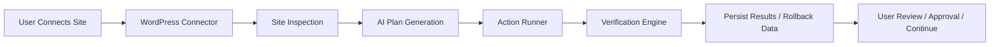

# WordPress Optimization Agent Architecture

## Goal

Turn GetSafe360's existing WordPress connection, scan, SSE, and optimization-loop primitives into a production-grade **WordPress Optimization Agent** that can:

1. connect to a WordPress site safely
2. inspect its stack and health
3. propose or apply safe improvements
4. verify the visible result
5. record every mutation and support rollback

This document is grounded in:

- the live Meer-Bau rebuild workflow
- the current `getsafe360-saas` repo structure
- the existing WordPress connector and optimization loop system already present in this repo

## What We Already Have In This Repo

### Frontend / SaaS

Existing primitives in `saas-ux`:

- WordPress connector routes:
  - `app/api/connect/start/route.ts`
  - `app/api/connect/provision/route.ts`
  - `app/api/wp-plugin/info/route.ts`
- WordPress client/auth utilities:
  - `lib/wordpress/client.ts`
  - `lib/wordpress/auth.ts`
  - `lib/wordpress/logger.ts`
- site records and connection metadata:
  - `lib/db/schema/sites/sites.ts`
- optimization loop persistence:
  - `lib/db/schema/optimization/loops.ts`
- generic optimization fix infrastructure:
  - `lib/optimization/fixes/*`
  - `lib/optimization/loops/*`
- SSE/event patterns:
  - `lib/cockpit/*`
  - `lib/homepage/*`

### Backend / Agent

Existing primitives in `crewai_backend`:

- `app.py`
- `crew.py`
- category prompts:
  - `prompts/accessibility/*`
  - `prompts/performance/*`
  - `prompts/security/*`
  - `prompts/seo/*`
  - `prompts/wordpress/*`

## Product Definition

The WordPress Optimization Agent should not initially be "AI redesigns any site autonomously."

The better product definition is:

**A safe WordPress-native optimization system that can audit, plan, apply, verify, and roll back targeted improvements across content, branding, media, technical SEO, and selected layout fixes.**

## Core Lessons From The Meer-Bau Workflow

The successful workflow was:

1. inspect the live public site
2. inspect the WordPress install and theme/builder/plugin state
3. determine the safest write path
4. create a child-theme customization boundary
5. deploy curated assets
6. update content using WordPress-native mutation
7. verify visually
8. patch rendering defects caused by builder markup quirks

This implies the platform should prioritize:

- CMS-native mutation over browser-only mutation
- explicit action types over free-form prompts
- verification after every meaningful step
- rollback-ready state tracking

## Recommended Architecture

## 1. System Overview

The WordPress Optimization Agent should be composed of five layers:

1. **Connection Layer**
2. **Inspection Layer**
3. **Planning Layer**
4. **Mutation Layer**
5. **Verification + Rollback Layer**

### High-level flow



## 2. Connection Layer

### Current fit in repo

Use and extend:

- `saas-ux/app/api/connect/start/route.ts`
- `saas-ux/app/api/connect/provision/route.ts`
- `saas-ux/lib/wordpress/auth.ts`
- `saas-ux/lib/wordpress/client.ts`
- `saas-ux/lib/db/schema/sites/sites.ts`

### Supported connection modes

The platform should support multiple connection modes, but with a preferred order:

1. **GetSafe360 WordPress connector plugin**
2. **WP REST + application password**
3. **SFTP / SSH**
4. **wp-admin browser automation only as fallback**

### Recommendation

For the WordPress agent MVP, treat the **GetSafe360 connector plugin** as the primary integration boundary.

This is stronger than trying to automate arbitrary wp-admin screens because it gives us:

- stable authentication
- known capability exposure
- predictable mutation actions
- better auditability

## 3. Inspection Layer

The inspection layer should build a normalized **WordPress Site Snapshot**.

### Required snapshot fields

- WordPress version
- active theme
- parent theme
- child theme presence
- page builder in use
- SEO plugin presence
- active plugins
- custom post types
- front page configuration
- menu configuration
- media health
- brand assets detected
- obvious rendering defects
- connection capabilities

### Proposed TypeScript contract

File to add later:

- `saas-ux/lib/wordpress/types.ts`

```ts
export interface WordPressSiteSnapshot {
  siteUrl: string;
  wpVersion?: string;
  pluginVersion?: string;
  activeTheme: {
    stylesheet: string;
    template: string;
    hasChildTheme: boolean;
  };
  builder: 'divi' | 'elementor' | 'gutenberg' | 'unknown';
  seoPlugin: 'yoast' | 'rankmath' | 'aioseo' | 'none' | 'unknown';
  frontPage?: {
    pageId?: number;
    title?: string;
    slug?: string;
  };
  capabilities: {
    read: boolean;
    write: boolean;
    themeFiles: boolean;
    mediaUpload: boolean;
    pageUpdate: boolean;
    rollback: boolean;
  };
  issues: Array<{
    id: string;
    category: 'branding' | 'content' | 'media' | 'seo' | 'layout' | 'technical';
    severity: 'low' | 'medium' | 'high';
    title: string;
    detail: string;
  }>;
}
```

### Data sources

The snapshot should be assembled from:

- connector plugin endpoints
- WordPress REST API
- optional SSH/WP-CLI enrichment
- public-page fetch/screenshot verification

## 4. Planning Layer

The planning layer should take:

- the site snapshot
- user intent
- safe capability constraints

and produce a structured **Action Plan**.

### Action plan principles

- every action must be typed
- every action must be reversible where possible
- every action must declare required capabilities
- every action must declare verification expectations
- low-risk actions should auto-apply by default
- medium-risk and high-risk actions should require approval unless policy explicitly allows otherwise

### Proposed action types

```ts
export type WordPressActionType =
  | 'create_child_theme'
  | 'upload_brand_assets'
  | 'activate_theme'
  | 'update_page_content'
  | 'create_page'
  | 'set_front_page'
  | 'update_theme_css'
  | 'update_theme_php'
  | 'create_menu'
  | 'assign_menu'
  | 'fix_broken_images'
  | 'apply_schema'
  | 'flush_cache'
  | 'verify_render';
```

### Proposed plan contract

```ts
export interface WordPressActionPlan {
  siteId: string;
  source: 'ai' | 'system' | 'mixed';
  objective: string;
  builder: 'divi' | 'elementor' | 'gutenberg' | 'unknown';
  actions: WordPressPlannedAction[];
}

export interface WordPressPlannedAction {
  id: string;
  type: WordPressActionType;
  title: string;
  risk: 'low' | 'medium' | 'high';
  autoApplyEligible: boolean;
  requiresApproval: boolean;
  requiresCapabilities: string[];
  payload: Record<string, unknown>;
  verification: {
    kind: 'dom' | 'screenshot' | 'api' | 'mixed';
    assertions: string[];
  };
}
```

## 5. Mutation Layer

This is the most important design decision.

### Default execution policy

The default UX for the WordPress agent should be:

1. auto-apply **low-risk** actions and fixes by default
2. queue **medium-risk** actions for review
3. require explicit approval for **high-risk** actions

Examples of low-risk auto-apply actions:

- meta tag updates
- JSON-LD injection
- media alt text improvements
- broken image URL replacement when the replacement is deterministic
- non-destructive content polish on draft or AI-managed pages

Examples that should stay approval-gated:

- child theme creation
- theme activation
- front-page reassignment
- template/PHP mutation
- menu restructuring
- destructive cleanup or rollback actions

### Preferred mutation order

From best to worst:

1. connector plugin action endpoint
2. WP-CLI through SSH
3. WordPress REST update endpoint
4. wp-admin form submission
5. browser automation against visual builder

### Recommendation

For GetSafe360, the connector plugin should become a **WordPress Action Gateway**.

Instead of exposing only `ping`, `status`, `push`, `fixes`, and `capabilities`, it should eventually expose specific safe actions such as:

- `inspect/theme`
- `inspect/pages`
- `inspect/plugins`
- `theme/create-child`
- `media/upload`
- `pages/update`
- `pages/create`
- `settings/front-page`
- `menus/list`
- `menus/update`
- `cache/flush`
- `backups/create`

This avoids brittle admin automation and gives the SaaS layer a deterministic contract.

## 6. Verification Layer

Every meaningful mutation should be followed by verification.

### Verification types

- API verification
- DOM verification
- screenshot verification
- asset health verification

### Existing fit in repo

Potential integration points:

- `saas-ux/app/api/screenshot/route.ts`
- `saas-ux/lib/cockpit/*`
- `saas-ux/lib/optimization/fixes/verifyFix.ts`

### Proposed verification contract

```ts
export interface VerificationResult {
  ok: boolean;
  actionId: string;
  checks: Array<{
    name: string;
    ok: boolean;
    detail?: string;
  }>;
  screenshotUrl?: string;
  domSummary?: string;
  errors?: string[];
}
```

## 7. Rollback Layer

Rollback must be first-class.

### Existing fit in repo

- `saas-ux/lib/optimization/fixes/rollbackFix.ts`
- `saas-ux/lib/db/schema/optimization/loops.ts`
- `appliedFixes.rollbackPayload`

### Recommendation

Expand rollback from snippet-level only into action-level rollback:

- restore previous page content
- deactivate child theme if newly created
- delete uploaded temporary assets if marked disposable
- reverse menu/front-page assignments
- delete connector-generated artifacts

### Proposed persistence additions

The current `appliedFixes` table is a good start, but WordPress page/theme changes need a broader action journal.

Recommended additions:

- `wordpress_action_runs`
- `wordpress_action_artifacts`
- `wordpress_snapshots`

These can either be new tables or folded carefully into the existing optimization loop model.

## Domain Model Proposal

## 8. Recommended New Tables

The current schema already supports sites, optimization loops, and applied fixes. The WordPress agent should add a more explicit execution model.

### A. `wordpress_site_snapshots`

Purpose:

- persist normalized inspection outputs
- support diffing before/after changes

Suggested fields:

- `id`
- `site_id`
- `source`
- `builder`
- `snapshot`
- `created_at`

### B. `wordpress_action_runs`

Purpose:

- record each mutation attempt

Suggested fields:

- `id`
- `site_id`
- `loop_id`
- `action_type`
- `status`
- `input_payload`
- `result_payload`
- `rollback_payload`
- `started_at`
- `completed_at`

### C. `wordpress_verifications`

Purpose:

- persist verification evidence

Suggested fields:

- `id`
- `action_run_id`
- `site_id`
- `checks`
- `screenshot_url`
- `dom_summary`
- `ok`
- `created_at`

## Repo Placement Recommendations

## 9. Frontend / SaaS placement

Recommended additions in `saas-ux`:

### API routes

- `app/api/wordpress/inspect/route.ts`
- `app/api/wordpress/plan/route.ts`
- `app/api/wordpress/apply/route.ts`
- `app/api/wordpress/verify/route.ts`
- `app/api/wordpress/rollback/route.ts`

### Domain libraries

- `lib/wordpress/types.ts`
- `lib/wordpress/inspect.ts`
- `lib/wordpress/plan.ts`
- `lib/wordpress/actions.ts`
- `lib/wordpress/verify.ts`
- `lib/wordpress/rollback.ts`

### DB schema

- `lib/db/schema/wordpress/*.ts`

### UI

- `components/wordpress/*`
- workflow screens in dashboard under site management / optimization views

## 10. Backend / agent placement

Recommended additions in `crewai_backend`:

- `wordpress_inspector.py`
- `wordpress_planner.py`
- `wordpress_mutator.py`
- `wordpress_verifier.py`

Or, if you want to keep backend thinner and more deterministic:

- keep mutation logic primarily in Next.js server routes / connector calls
- use CrewAI mainly for planning, prioritization, and content generation

That second option is the better fit for reliability.

## Recommended Execution Model

## 11. Safe execution phases

The WordPress agent should run in explicit phases:

1. `connect`
2. `inspect`
3. `snapshot`
4. `plan`
5. `approve` or `auto-authorize`
6. `apply`
7. `verify`
8. `persist`
9. `rollback` if needed

This maps well to the existing loop mentality in:

- `lib/db/schema/optimization/loops.ts`
- `lib/optimization/loops/runner.ts`

### Suggested relationship to existing optimization loops

Two workable models:

1. extend the existing optimization loop system to include WordPress actions
2. create a WordPress-specific orchestrator that can optionally spawn optimization loops

Recommendation:

- keep the existing optimization loops for category scoring and iterative improvements
- introduce a **WordPress orchestration layer** above them

Reason:

- WordPress connection, theme mutations, and page-building actions are broader than score loops alone

## MVP Definition

## 12. Recommended first vertical slice

Implement a narrow but valuable MVP:

### MVP user outcome

"Connect a WordPress site, inspect it, create a child theme if missing, rebuild the homepage draft, verify it visually, and present rollback-safe results."

### MVP scope

- supported CMS: WordPress only
- supported builders:
  - Divi
  - Gutenberg
- connection mode:
  - connector plugin first
  - SSH optional
- mutation set:
  - create child theme
  - upload assets
  - update front page
  - set front page if needed
  - apply CSS/branding
  - verify screenshot + basic DOM assertions

### Why this slice

It directly matches the proven Meer-Bau workflow and is already close to the current repo capabilities.

## Suggested Action Contracts For MVP

## 13. MVP actions

### `create_child_theme`

Payload:

- parent theme slug
- child theme slug
- theme name
- base files

### `upload_brand_assets`

Payload:

- files
- logical usage:
  - logo
  - hero
  - gallery

### `update_page_content`

Payload:

- page id
- title
- content
- builder hint

### `update_theme_css`

Payload:

- target file
- css string
- replace or append mode

### `verify_render`

Payload:

- url
- assertions:
  - heading text
  - image load success
  - section selectors

## WordPress Connector Evolution

## 14. Plugin evolution roadmap

The existing connector appears focused mainly on connectivity and snippet injection. To support the WordPress Optimization Agent, the plugin should evolve into capability tiers.

### Connector capability tiers

#### Tier 1: connection

- ping
- status
- capabilities

#### Tier 2: snippet and lightweight fix push

- push fixes
- list fixes
- delete fixes

#### Tier 3: inspection

- inspect themes
- inspect plugins
- inspect pages
- inspect settings

#### Tier 4: safe content mutation

- update pages
- create pages
- upload media
- set front page

#### Tier 5: filesystem-aware theme operations

- create child theme
- write theme files
- list theme files

#### Tier 6: rollback and backup support

- create snapshot
- restore content snapshot
- flush cache

## Risks And Constraints

## 15. Risks to design around

### Builder fragmentation

Different builders serialize content very differently.

Mitigation:

- builder detection first
- start with Divi + Gutenberg only

### Theme safety

Parent-theme editing is risky.

Mitigation:

- child theme creation by default

### Caching / CDN invisibility

Changes may not be visible instantly.

Mitigation:

- cache flush capability
- asset versioning
- delayed verification retries

### Host restrictions

Not every WordPress host allows SSH or WP-CLI.

Mitigation:

- connector plugin as primary mutation channel

### Over-autonomy

Full free-form AI mutation can break client sites.

Mitigation:

- typed actions
- capability checks
- approval modes
- rollback payloads

## Recommended Next Implementation Slices

## 16. Priority order

### Slice 1: architecture foundations

- add WordPress domain types
- define action plan schema
- define verification result schema
- define connector capability schema

### Slice 2: inspection

- implement `/api/wordpress/inspect`
- return normalized `WordPressSiteSnapshot`

### Slice 3: persistence

- add WordPress snapshot/action/verification tables

### Slice 4: action runner

- implement `create_child_theme`
- implement `update_page_content`
- implement `update_theme_css`

### Slice 5: verification

- screenshot + DOM assertion pass

### Slice 6: UI

- site inspection panel
- action-plan review panel
- before/after verification panel

## Immediate Engineering Recommendation

The next practical step in this repo should be:

1. add the TypeScript contracts for WordPress snapshots, actions, and verification
2. implement a first `inspect` route using `lib/wordpress/client.ts`
3. extend the connector capability map to advertise mutation support
4. wire a first WordPress homepage-rebuild flow into the existing optimization model

If we do that, we stop talking about a WordPress Optimization Agent in the abstract and start building the exact seams the product will depend on.
